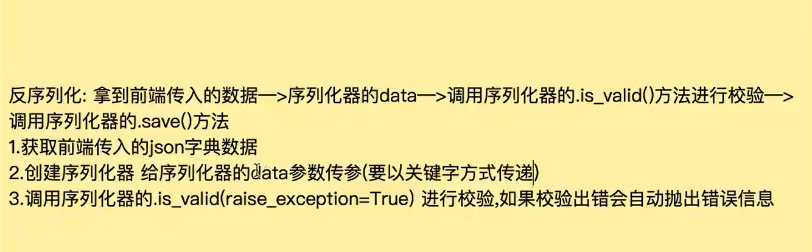
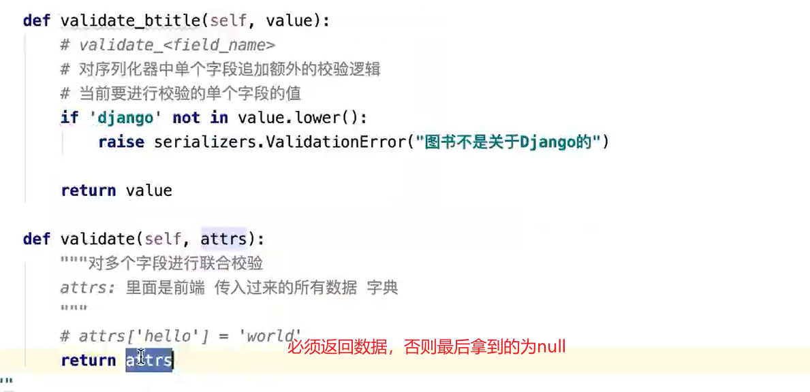

<!-- START doctoc generated TOC please keep comment here to allow auto update -->
<!-- DON'T EDIT THIS SECTION, INSTEAD RE-RUN doctoc TO UPDATE -->
**Table of Contents**  *generated with [DocToc](https://github.com/thlorenz/doctoc)*

- [视频资源](#%E8%A7%86%E9%A2%91%E8%B5%84%E6%BA%90)
- [DRF实现增删改查标准接口](#drf%E5%AE%9E%E7%8E%B0%E5%A2%9E%E5%88%A0%E6%94%B9%E6%9F%A5%E6%A0%87%E5%87%86%E6%8E%A5%E5%8F%A3)
- [序列化器的序列化操作](#%E5%BA%8F%E5%88%97%E5%8C%96%E5%99%A8%E7%9A%84%E5%BA%8F%E5%88%97%E5%8C%96%E6%93%8D%E4%BD%9C)
- [定义序列化器的序列化操作及关联序列化](#%E5%AE%9A%E4%B9%89%E5%BA%8F%E5%88%97%E5%8C%96%E5%99%A8%E7%9A%84%E5%BA%8F%E5%88%97%E5%8C%96%E6%93%8D%E4%BD%9C%E5%8F%8A%E5%85%B3%E8%81%94%E5%BA%8F%E5%88%97%E5%8C%96)
- [反序列化的操作](#%E5%8F%8D%E5%BA%8F%E5%88%97%E5%8C%96%E7%9A%84%E6%93%8D%E4%BD%9C)
- [django中jwt的操作&RBAC（基于角色的权限控制）](#django%E4%B8%ADjwt%E7%9A%84%E6%93%8D%E4%BD%9Crbac%E5%9F%BA%E4%BA%8E%E8%A7%92%E8%89%B2%E7%9A%84%E6%9D%83%E9%99%90%E6%8E%A7%E5%88%B6)
- [企业中的Web项目类型](#%E4%BC%81%E4%B8%9A%E4%B8%AD%E7%9A%84web%E9%A1%B9%E7%9B%AE%E7%B1%BB%E5%9E%8B)

<!-- END doctoc generated TOC please keep comment here to allow auto update -->


# 视频资源

认为不错一些视频资源

[黑马02-Django REST Framework框架学习](https://www.bilibili.com/video/BV1Sz4y1o7E8?p=24&spm_id_from=pageDriver)

[老男孩Python全栈开发29期全套](https://www.bilibili.com/video/BV11z4y1o79Q?p=4)

# DRF实现增删改查标准接口

- 注册：rest_framework

- 十行代码实现增删改查

  ```python
  
  新建序列化器
  class BookInfoSerializer(serializer.ModelSerializer):
      """定义序列化器"""
      class Meta:
          model = BookInfo # 指定序列化器从哪个模型映射字段
          fields = '_all_' # 映射哪些字段
  
  定义视图：
  from rest_framework.viewsets import ModelViewSet
  class BookInfoView(ModelViewSet):
  """
  定义类视图
  """
  #指定查询集
  queryset = BookInfo.objects.all()
  #指定序列化器
  serializer_class = 'BookInfoSerializer'
  
  路由：
  from rest_framework.routers import DefaultRouter
  router = DefaultRouter() # 创建路由器
  router.register(r'books',views.BookInfoView) # 注册路由
  urlpatterns +=router.urls # 把生成好的路由拼接到urlpatterns
  
  ```

  

# 序列化器的序列化操作

什么是序列化：就是把模型转化为数据

什么是反序列化：就是把数据转换为模型

简单的描述


# 定义序列化器的序列化操作及关联序列化

通过对象.data拿取数据


一般用第一个和第三个

不能两者互相关联序列化


# 反序列化的操作







# django中jwt的操作&RBAC（基于角色的权限控制）


# 企业中的Web项目类型


