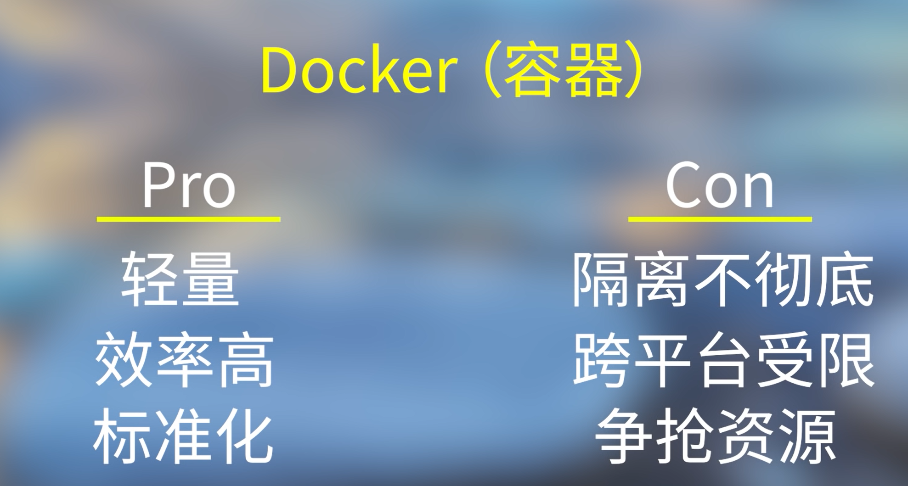
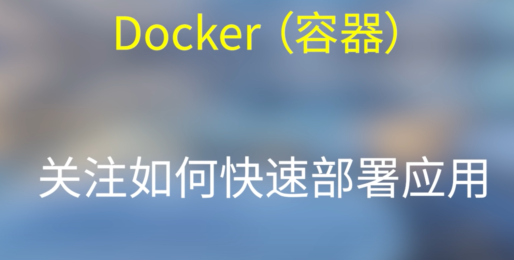
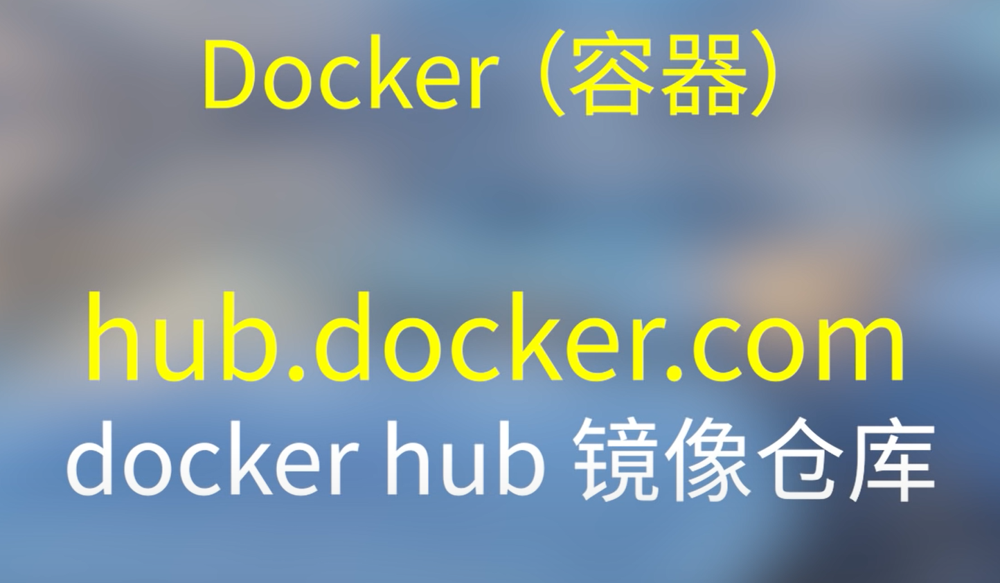
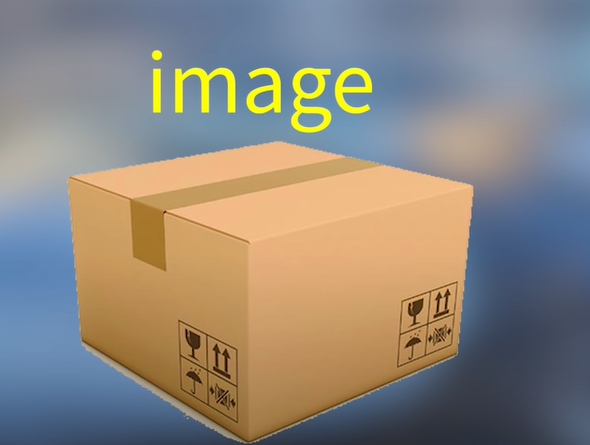
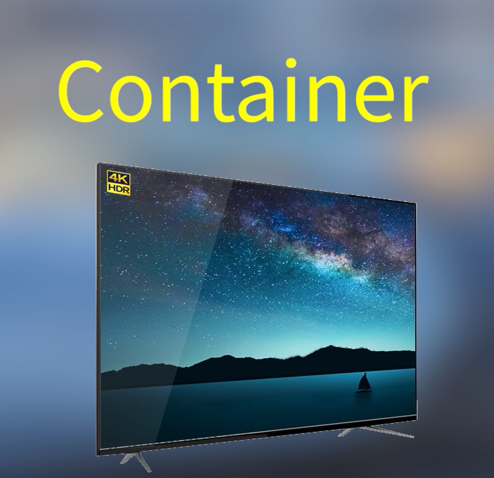
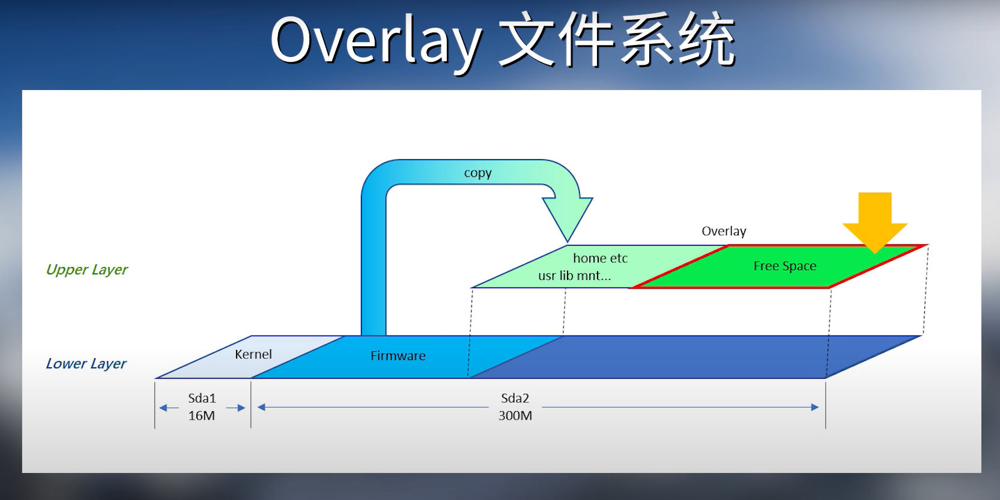
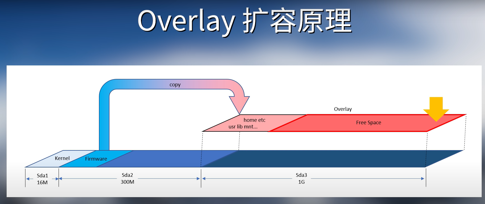
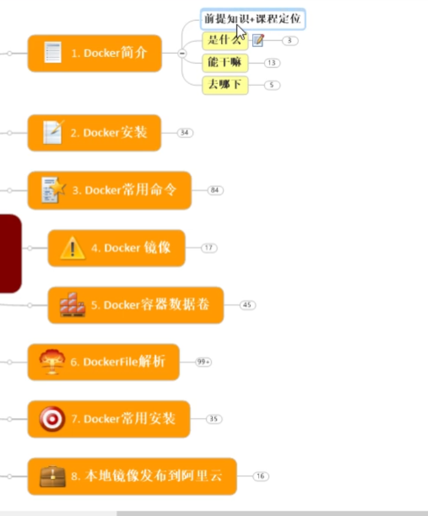

# [原理及背景知识]([玩转Dockerの第一弹，入门篇。原理及背景知识 - YouTube](https://www.youtube.com/watch?v=isr6cPKy8eg))


## 虚拟机

独立！


## 容器

只想要跑起来

进程隔离










## docker的安装&使用

```shell
    2  sudo apt update
    3  sudo apt-get install docker.io
    4  sudo service docker start
    8  docker start
```

## Overlay

用来扩容可用空间






新增一个分区，然后指向这个新分区，跟软链接一样

# Docker基础篇之快速上手



