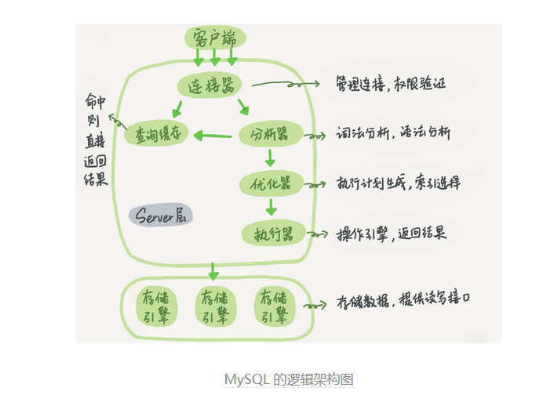
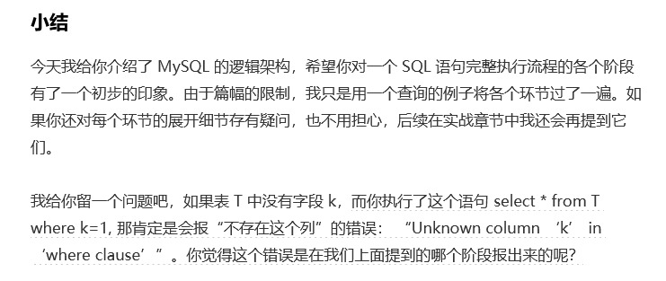

<!-- START doctoc generated TOC please keep comment here to allow auto update -->
<!-- DON'T EDIT THIS SECTION, INSTEAD RE-RUN doctoc TO UPDATE -->
**Table of Contents**  *generated with [DocToc](https://github.com/thlorenz/doctoc)*

- [基础篇](#%E5%9F%BA%E7%A1%80%E7%AF%87)
  - [基础架构：一条sql语句是如何执行的](#%E5%9F%BA%E7%A1%80%E6%9E%B6%E6%9E%84%E4%B8%80%E6%9D%A1sql%E8%AF%AD%E5%8F%A5%E6%98%AF%E5%A6%82%E4%BD%95%E6%89%A7%E8%A1%8C%E7%9A%84)
    - [优化器](#%E4%BC%98%E5%8C%96%E5%99%A8)
    - [小结](#%E5%B0%8F%E7%BB%93)

<!-- END doctoc generated TOC please keep comment here to allow auto update -->

# 基础篇

## 基础架构：一条sql语句是如何执行的

```sql

mysql> select * from T where ID=10；
```



Server 层包括连接器、查询缓存、分析器、优化器、执行器等，涵盖 MySQL 的大多数核心服务功能，以及所有的内置函数（如日期、时间、数学和加密函数等），所有跨存储引擎的功能都在这一层实现，比如存储过程、触发器、视图等。

而存储引擎层负责数据的存储和提取。其架构模式是插件式的，支持 InnoDB、MyISAM、Memory 等多个存储引擎。现在最常用的存储引擎是 InnoDB，它从 MySQL 5.5.5 版本开始成为了默认存储引擎。

也就是说，你执行 create table 建表的时候，如果不指定引擎类型，默认使用的就是 InnoDB。不过，你也可以通过指定存储引擎的类型来选择别的引擎，比如在 create table 语句中使用 engine=memory, 来指定使用内存引擎创建表。不同存储引擎的表数据存取方式不同，

### 优化器

优化器蛮funny的

那么

```sql
mysql> select * from t1 join t2 using(ID)  where t1.c=10 and t2.d=20;
```

对于这条sql语句，

既可以先从表 t1 里面取出 c=10 的记录的 ID 值，再根据 ID 值关联到表 t2，再判断 t2 里面 d 的值是否等于 20。

也可以先从表 t2 里面取出 d=20 的记录的 ID 值，再根据 ID 值关联到 t1，再判断 t1 里面 c 的值是否等于 10。

### 小结



那么，小结中问题的答案是**分析器**！

原文如下：

```tex
MySQL 从你输入的"select"这个关键字识别出来，这是一个查询语句。它也要把字符串“T”识别成“表名 T”，把字符串“ID”识别成“列 ID”。
```

