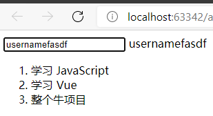

# step01

**渐进式JavaScript框架**----**由核心库与插件组成**

- 按需求添加插件
- MVVM:model(模型，数据对象) view(视图，模板页面) viewModel(视图模型，Vue的实例)

## 循环与绑定

```vue
<html lang="en">
<head>
    <meta charset="UTF-8">
    <title>p2</title>
</head>
<body>
<div id="app">
    <input type="text" v-model="username">
    {{username}}
</div>
<div id="app-4">
    <ol>
        <li v-for="todo in todos">
            {{ todo.text }}
        </li>
    </ol>
</div>
<script src="https://cdn.jsdelivr.net/npm/vue/dist/vue.js"></script>
<script type="text/javascript">
    const vm = new Vue({
        el: '#app',
        data: {
            username: 'username'
        }
    })

    var app4 = new Vue({
        el: '#app-4',
        data: {
            todos: [
                { text: '学习 JavaScript' },
                { text: '学习 Vue' },
                { text: '整个牛项目' }
            ]
        }
    })
</script>
</body>
</html>
```



## 使用vue-route&axios调取接口数据

- components new goods.vue,

  ```vue
  <template>
    <h1>this is goods{{msg}}</h1>
  </template>
  
  <script>
  // eslint-disable-next-line no-unused-vars
  import {AxiosInstance as axios} from 'axios'
  
  export default {
    name: 'goods',
    data () {
      return {
        msg: ''
      }
    },
    created () {
      this.axios.get('http://localhost:8000/categorys/74').then(response => {
        this.msg = response.data
        console.log(response.data)
      })
    }
  }
  </script>
  
  <style scoped>
  
  </style>
  
  ```

- router/index.js

  ```javascript
  import Vue from 'vue'
  import Router from 'vue-router'
  import HelloWorld from '@/components/HelloWorld'
  import goods from '../components/goods'
  
  Vue.use(Router)
  
  export default new Router({
    routes: [
      {
        path: '/',
        name: 'HelloWorld',
        component: HelloWorld
      },
      {
        path: '/goods',
        name: 'Goods',
        component: goods
      }
    ]
  })
  
  ```

- main.js

  ```javascript
  // The Vue build version to load with the `import` command
  // (runtime-only or standalone) has been set in webpack.base.conf with an alias.
  import Vue from 'vue'
  import App from './App'
  import router from './router'
  // eslint-disable-next-line no-unused-vars
  import axios from 'axios'
  
  Vue.prototype.axios = axios
  Vue.config.productionTip = false
  
  /* eslint-disable no-new */
  new Vue({
    el: '#app',
    router,
    components: { App },
    template: '<App/>'
  })
  ```

- App.vue

  ```vue
  <template>
    <div id="app">
      
      <router-link to="/goods">goods</router-link>
      <router-view/>
    </div>
  </template>
  
  <script>
  export default {
    name: 'App'
  }
  </script>
  
  <style>
  #app {
    font-family: 'Avenir', Helvetica, Arial, sans-serif;
    -webkit-font-smoothing: antialiased;
    -moz-osx-font-smoothing: grayscale;
    text-align: center;
    color: #2c3e50;
    margin-top: 60px;
  }
  </style>
  
  ```

  

## 使用nuxt&axios调取接口数据

- 跨域需要更改的配置：nuxt.config.js

```javascript
axios: {
    proxy:true,//开启axios跨域
    // prefix:'/api',
  },

  proxy:{
    '/api/':{
      target:'http://localhost:8000',//代理转发的地址
      changeOrigin:true,
      pathRewrite:{
      }
    }
  },
```

- 首页：layouts/default.vue

```vue
<template>
  <div>
<!--    声明式跳转-->
    <nuxt-link to="/">首页</nuxt-link>
    <nuxt-link to="/goods">商品</nuxt-link>
    <nuxt-link to="/login">登录</nuxt-link>
    <nuxt-link to="/reg">注册</nuxt-link>
    <nuxt-link to="/user">用户中心</nuxt-link>
    <!--    展示区-->
    <Nuxt />
  </div>
</template>
```

- 组件：pages/goods.vue

```vue
<template>
  <div class="goods">
    <h3>商品</h3>
    <p>{{results}}</p>
<!--    <nuxt-link to="/goods/category/1?a=1&b=2">商品分类01</nuxt-link>-->
<!--    <nuxt-link :to="{name:'goods-category-id',params:{uid:1},query:{a:1,b:2}}">商品分类</nuxt-link>-->
<!--    <nuxt-link to="/goods/comments">商品的评论</nuxt-link>-->
<!--    <nuxt/>-->
  </div>
</template>

<script>
  export default {
    async asyncData({$axios}) {
      let res = await $axios({url:'http://127.0.0.1:8000/goods/'})
      console.log('object',res.data)
      return {
        results:res.data
      }
    },

    async fetch({$axios}){
      // let res = await $axios({url:'http://127.0.0.1:8000/goods/'})
      // console.log('res',res.data.results)
      // return {
      //   results:res.data.results
      // }
    },

    components: {
    },

  }
</script>

```

